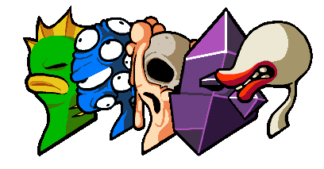
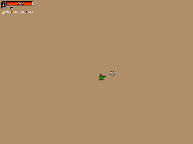
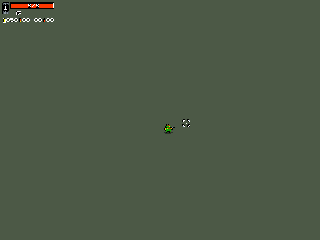
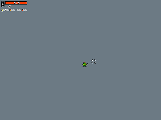
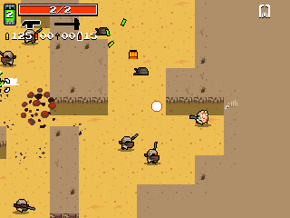

# Random level generation in Wasteland Kings
*Written by Jan Willem Nijman from Vlambeer on April 2nd, 2013* 
*Vlambeer consisted of: [Jan Willem Nijman](https://twitter.com/jwaaaap), and [Rami Ismail (رامي)](https://twitter.com/tha_rami)* 
*Original Source: http://www.vlambeer.com/2013/04/02/random-level-generation-in-wasteland-kings*

  1. [Make some floors](#step1)
  2. [Make some rooms](#step2)
  3. [Splitting the corridors](#step3)
  4. [Placing chests](#step4)
  5. [Level size](#step5)
  6. [Placing the Player, Enemies and Walls](#step6)
  7. [Graphics](#step7)
  8. [Gameplay](#step8)
  

  
*Wasteland Kings is a game we made in three days for MOJAM. 
It’s an action roguelike about mutants blasting their way through dangerous areas while searching for powerful weapons and growing new limbs on the fly.*

*Because we had a very limited timeframe to make this game (and JW doesn’t know any maths) everything was made with super fast, hacky, dumb logic. 
Our level generation was made in a couple of hours, but turned out very decent, supplying players with an infinite amount of very playable levels. 
This post is about how we did that.*

*Take note that our solutions are all hand-tweaked for this particular game. 
Some things might not make a lot of sense or have any reasoning behind them, but that’s just how we make games. 
Massive thanks to [Paul](https://twitter.com/pietepiet), [Jukio](https://twitter.com/jukiokallio) and [Joonas](http://twitter.com/KissaKolme), because respectively their art, music and sound effects really made the game what it is today and kept us inspired and working hard all the way through this project!*

Lets get started.

<a name="step1"/>
  
## Step 1: Make some floors

Every area starts by creating a FloorMaker. 
Every iteration a FloorMaker will move 1 tile forward and make a Floor. 
Depending on what area (Desert, Sewers or Scrapyard in this case) it is generating there will be different chances for it to turn 90, -90 or even 180 degrees. 
For example, the Scrapyard has no 180 degree turns and thus moves straight forward more frequently, giving it a lot of long, straight corridors.

<a name="step2"/>
  
## Step 2: Make some rooms

To allow for more interesting gameplay, FloorMakers have a chance to place Floors in a shape.
In the Desert there is a 50% chance for it to place 2×2 Floors. 
This will create more open areas. 
In the Scrapyard there is a 11% chance for 3×3 Floors to spawn, creating little rooms, perfect for interesting shootouts and tight dodging.

At the Game Developers Conference in San Francisco (we’ll have a write-up on GDC and PAX soon) JW talked to [Beau Blyth](https://twitter.com/beaublyth) about his game Shoot First, one of the many inspirations for Wasteland Kings. 
It turns out he used a very similar technique for his levels!

<a name="step3"/>
  
## Step 3: Splitting the corridors

We wanted players to do some exploring. 
Every frame a FloorMaker has a small chance to create a new FloorMaker. 
The chance of a new FloorMaker to appear depends on the amount of FloorMakers already active and the area we are in. 
Sewer for example has a lot of corridors, because we allow it to spawn a lot of FloorMakers. 
If more than one FloorMaker exists, they get an increasingly large chance to destroy themselves, to make sure the levels don’t have too many long hallways heading in different directions.

<a name="step4"/>
  
## Step 4: Placing chests

There are three types of chests found in levels in wasteland kings. 
We have Weapon Chests, big Ammo Chests and Experience Canisters. 
Usually one of each is found in every area. 
We wanted to spawn these in interesting places (mainly dead ends) in the levels, to reward players for exploring. 
The way we did this is horrible but effective.

Whenever a FloorMaker turns 180 degrees, it spawns a Weapon Chest. 
Whenever a FloorMaker destroys itself, it spawns an Ammo Chest. 
Whenever the level is reaching its final size, FloorMakers spawn Experience Canisters.

After the level generation is done all but the furthest (with a bit of a random offset) chests of each type are removed.

> Fun fact: When making the animated gifs for this posts we found out that the weapon chests are placed after turning 180 degrees and moving one tile, instead of on the tile of the turn itself.

<a name="step5"/>
  
## Step 5: Level size

The game counts the amounts of Floors. In our case, the max is 110 Floors per level. When a FloorMaker notices there are more than 110 Floors it does one more step and then destroys itself. The amount of Floors divided by 110 is the percentage shown while the game is loading.

Because we still place one more set of Floors after reaching 110, the game usually loads to 101%. We kept that in to show the world we put a lot of extra effort into our games.

<a name="step6"/>
  
## Step 6: Placing the Player, Enemies and Walls

> **WARNING: The way we did this is very dumb.**

The Player is simply spawned on the place we spawned the first FloorMaker.

Enemies can spawn anywhere far enough from the Player as long as there are no chests there. 
We just check all the Floors and give them a random chance to spawn some Enemies depending on  the current difficulty. 
Enemy type and rarity depends on the area. 

> For example: a tile in the desert can spawn either a Bandit, Maggot, Corpse, Scorpion or a group of unwise Bandits warming themselves around an explosive barrel.

We then place Walls around all the Floors. 
Every Floor has a small chance to spawn a Wall on one of it’s 4 corners. 
Finally, there is a 14% chance for a Wall in Scrapyard to become a firetrap.

It later turned out these randomly spawned Walls were able to block corridors. 
We tried fixing it in the last 7 minutes of the jam but it turned out we failed. 
Luckily, occurrence of this is super rare, seeing we were testing the game for three days but only saw this happen once.

<a name="step7"/>
  
## Step 7: Graphics

Every Wall side, Wall top and Floor has 4 different versions per area. 
The first graphic is very common, second or third are shown 22% of the time. 
The fourth one was supposed to show less than 1% of the time, but the code for that was broken and nobody ever saw these. 
Sorry.

<a name="step8"/>
  
## Step 8: Gameplay

Finally and most importantly, make sure your gameplay is suitable for these kinds of levels.

Our enemies drop experience and sometimes items when killed. 
These drops and experience disappear over time. 
This encourages people to move into places they normally wouldn’t need to go.

Our exits spawn when the final enemy is killed, this allowed us to not have to worry too much about exit and start placement. 
A problem with this was that sometimes people missed some items because they were sucked into the exit. 
On the other hand, this also generated some cool gameplay when people where already being sucked into an exit, but still managed to shoot an experience canister, leveling up just a split second before going to the next level. 
(Our exits also suck in experience and smaller pickups to let people not have to deal with that manually after beating a level.)

Our classes use space in an interesting way. 
Fish rolls, crystal can shield himself from damage, plant can create choke points and pin enemies down and eyes can move enemies and enemy projectiles around. 
Melting even uses enemy corpses as a resource (blowing them up), which suddenly makes positioning them relevant.

Enemies are always moving around a bit, even when the player isn’t anywhere near them. 
Some enemies charge at you, some flee, some just dance around. 
They fill spaces differently.

Shotgun bullets bounce, bolts pierce, melee weapons can be used through walls but have less reach.

The way you and the systems interact with the level is way more important than the shape of the level itself. 
The level is just there to bring people what they want. 
In this case we  brought them an infinite wasteland filled with monsters, weapons and treasure. 
We wanted them to have fun.

*Wasteland Kings became: [Nuclear Throne](https://store.steampowered.com/app/242680/Nuclear_Throne/)*
